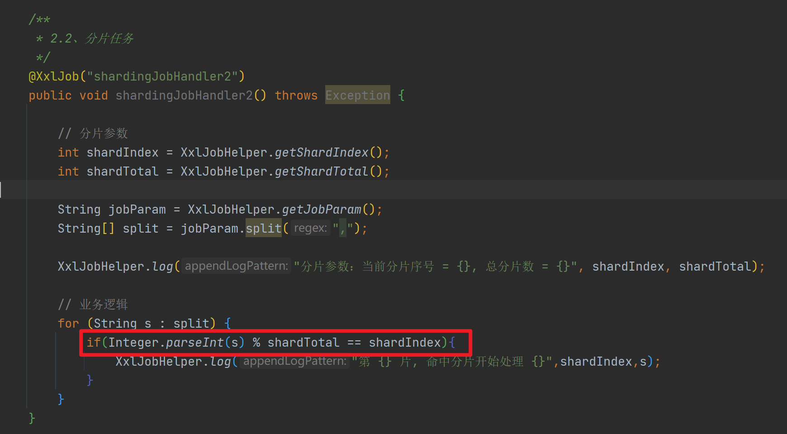
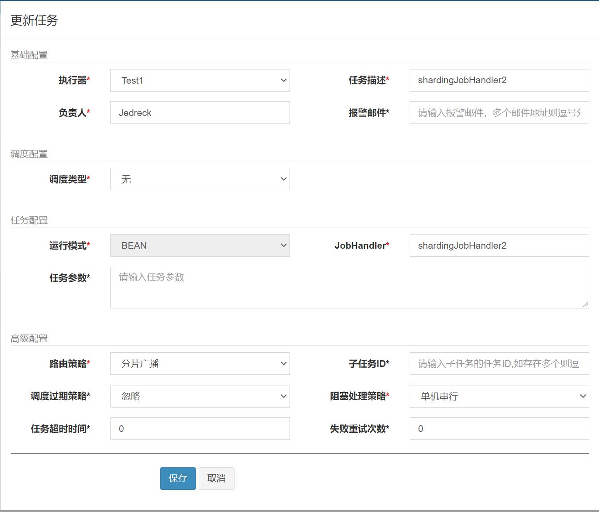
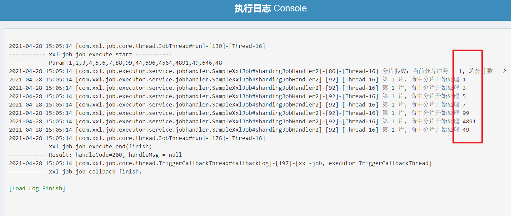
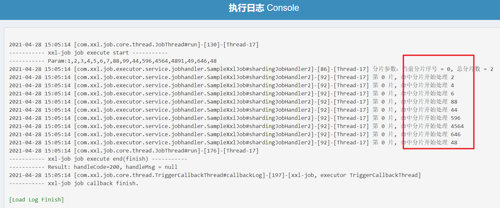

### xxlJob分片任务

分片任务就是一个任务，开始时由机器进行判断是否要执行相应业务，并在业务

分片任务执行参考官方包中的实验

 `com.xxl.job.executor.service.jobhandler.SampleXxlJob#shardingJobHandler2` 

- 代码

  

- 任务策略必须为 `分片广播` 

  

- 执行结果

  

  

